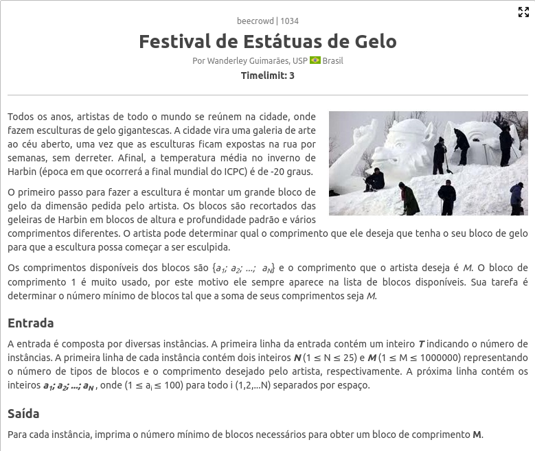
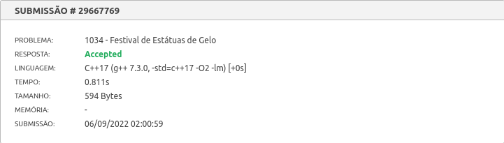
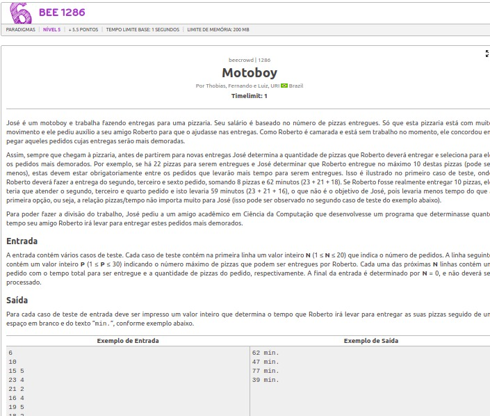

# Resolução de Exercícios

**Conteúdo da Disciplina**: PD 

## Alunos
|Matrícula | Aluno |
| -- | -- |
| 180149598  |  Victor Hugo SIqueira Costa |
| 180029240  |  Wesley Pedrosa dos Santos |

## Sobre 
Resolução de exercícios envolvendo Programação Dinâmica pela dupla 12 (Victor Hugo e Wesley Santos). Foi utilizada a plataforma **beecrowd** para obter os exercícios e testar as soluções.

## Screenshots
[Festival de Estátuas de Gelo](https://www.beecrowd.com.br/judge/pt/problems/view/1034) 
 
 

[Motoboy](https://www.beecrowd.com.br/judge/pt/problems/view/1286) 
 
 

## Instalação e Uso
**Linguagem**: C++ 
Para testar os códigos e conseguir os *aceppted* basta ir no link de cada um dos exercícios e submeter o respectivo código para a plataforma poder avaliar. 

